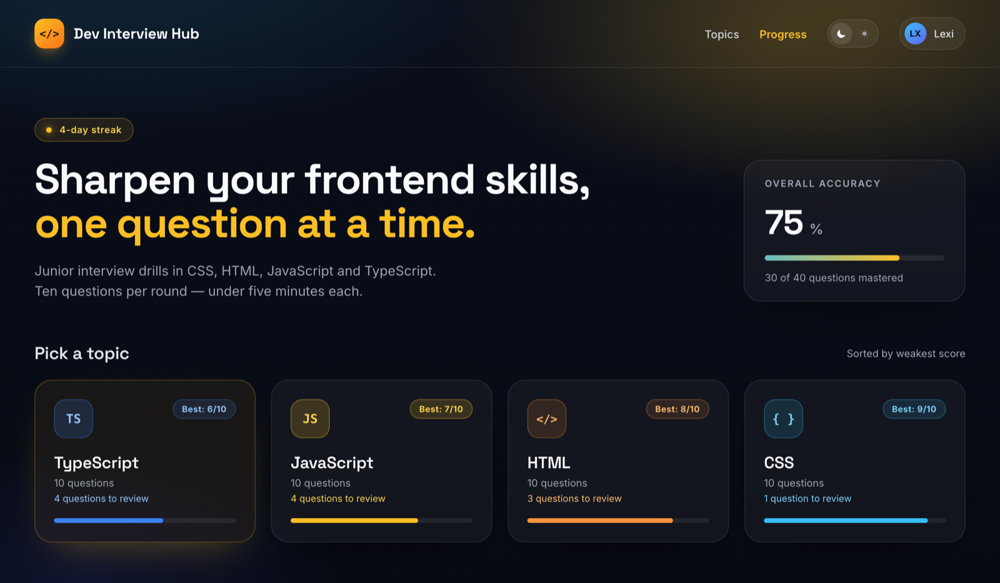
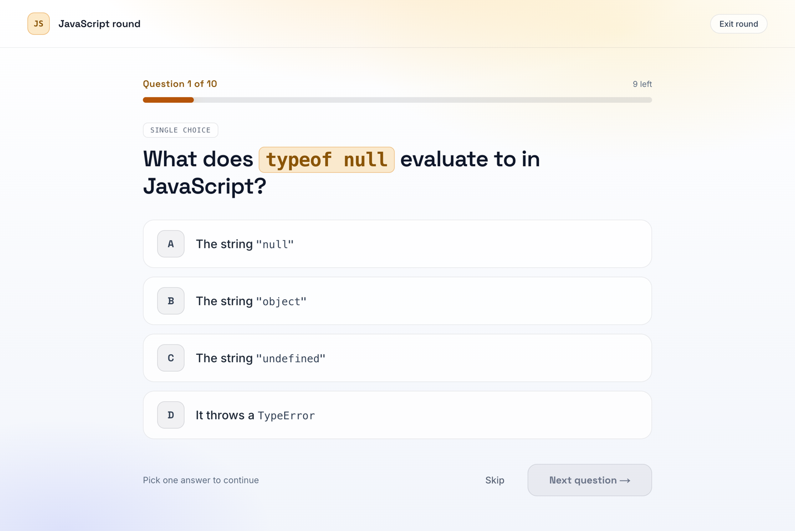
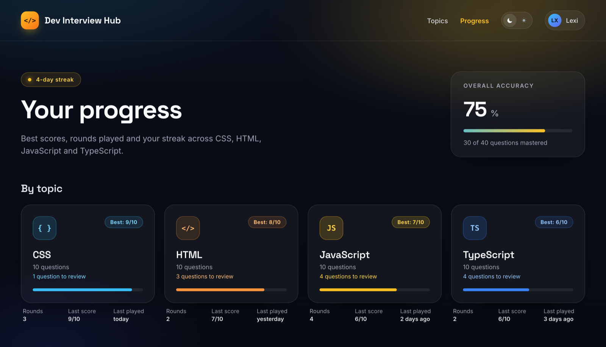

# Dev Interview Hub

A quiz app for Junior Frontend / Full-Stack interview prep: four topics (CSS,
HTML, JavaScript, TypeScript), ten single-choice questions each, scored results
and per-topic best scores. Glassmorphic dark and light themes at full parity.

**Live demo: [dev-interview-hub.vercel.app](https://dev-interview-hub.vercel.app/)**



## Features

- **Four topic rounds** — CSS, HTML, JavaScript and TypeScript, ten
  single-choice questions each, with code fragments in the prompts and answers
  rendered as inline code.
- **Scored results** — score ring, correct/incorrect tally and a per-question
  breakdown, with retry and back-to-topics actions.
- **Progress that sticks** — best score, rounds played, last score and last
  played date per topic, plus a day streak and overall accuracy, kept in
  `localStorage` so nothing needs a backend or an account.
- **Guidance, not just numbers** — topics are sorted weakest-first, the weakest
  topic is highlighted, cards say how many questions are left to review, and on
  mobile a sticky button resumes the most recent round.
- **Dark and light at parity** — `"system" | "dark" | "light"`, applied before
  first paint so there is no flash; `"system"` keeps following the OS.
- **Phone-first** — one breakpoint (`sm` = 520px); base styles are the phone
  layout.

|                    Quiz round (light)                    |                     Progress (dark)                      |
| :------------------------------------------------------: | :------------------------------------------------------: |
|  |  |

## Stack

Next.js (App Router) · TypeScript · Tailwind CSS v4 · shadcn/ui (Radix) ·
Vitest + React Testing Library

## Pages

| Route                   | Shows                                                    |
| ----------------------- | -------------------------------------------------------- |
| `/`                     | Topic picker, streak and overall accuracy                |
| `/quiz/[topic]`         | Ten-question quiz for one topic                          |
| `/quiz/[topic]/results` | Score, tally and per-question breakdown for that attempt |
| `/progress`             | Best score, rounds and last played per topic             |

## Getting started

```bash
npm install
npm run dev
```

## Scripts

| Command              | What it does                        |
| -------------------- | ----------------------------------- |
| `npm run dev`        | Dev server on http://localhost:3000 |
| `npm run build`      | Production build                    |
| `npm start`          | Serve the production build          |
| `npm run typecheck`  | `next typegen && tsc --noEmit`      |
| `npm run lint`       | ESLint                              |
| `npm test`           | Vitest (single run)                 |
| `npm run test:watch` | Vitest in watch mode                |

## Project structure

```
src/
  app/          Routes (home, quiz, results, progress) + globals.css
  components/   home · quiz · results · progress · topics · shell · theme · ui
  lib/          questions/ (content + types) · quiz · results · progress · theme
```

## Deployment

The app is deployed on [Vercel](https://vercel.com) at
<https://dev-interview-hub.vercel.app/>. No environment variables are needed —
Vercel detects Next.js and runs `npm run build`.

## Design tokens & theming

- Every color, radius, shadow and font size is a CSS custom property in
  [`src/app/globals.css`](src/app/globals.css). Theme-dependent values are
  defined once under `[data-theme="dark"]` and once under
  `[data-theme="light"]`; Tailwind utilities (`bg-glass`, `text-ink-muted`,
  `shadow-card`, `rounded-card`, `text-question`…) read them via
  `@theme inline`. Component code never contains a raw color — a test enforces
  it.
- Accent families (`css`, `html`, `js`, `ts`, `correct`, `incorrect`, `brand`,
  `streak`, `neutral`, `glass`) are `tone-*` utilities that point generic
  `--tone-*` slots at one palette, so pills, card hovers and progress fills take
  a `tone` prop instead of per-topic styles.
- The theme preference is `"system" | "dark" | "light"` in `localStorage`
  (`theme`). An inline script in the root layout sets `data-theme` on `<html>`
  before first paint; `"system"` keeps tracking OS changes live. The ☾/☀ toggle
  pins a theme; picking the lit segment again returns to `"system"`.
- One breakpoint: `sm` = 520px. Base styles are the phone layout.

Visit **`/tokens`** in development for the reference sheet: every primitive in
every state, rendered in both themes side by side. It returns 404 in production,
so it isn't available on the Vercel deployment.
