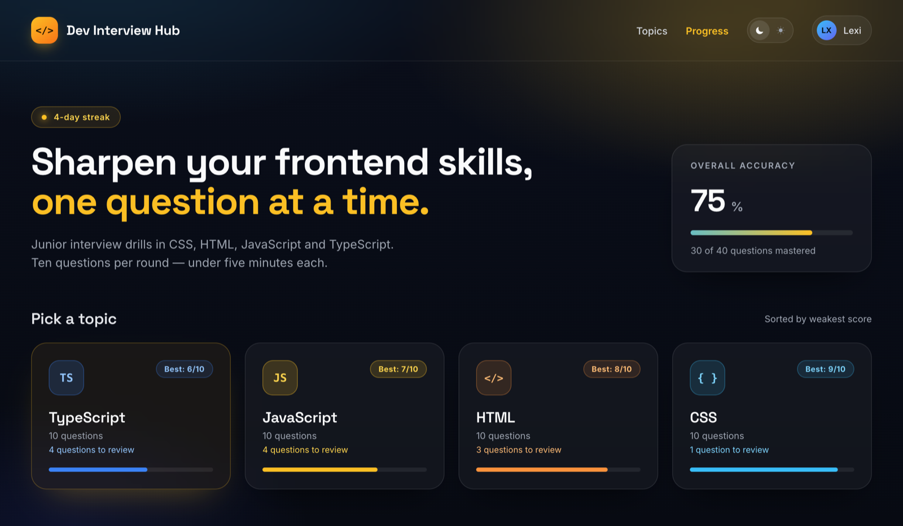
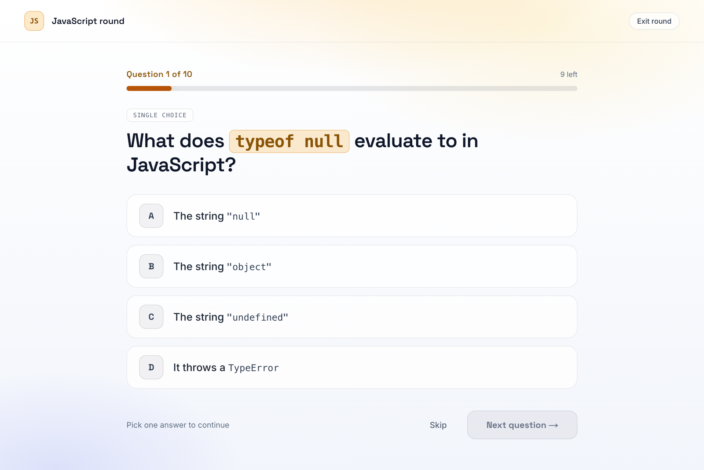
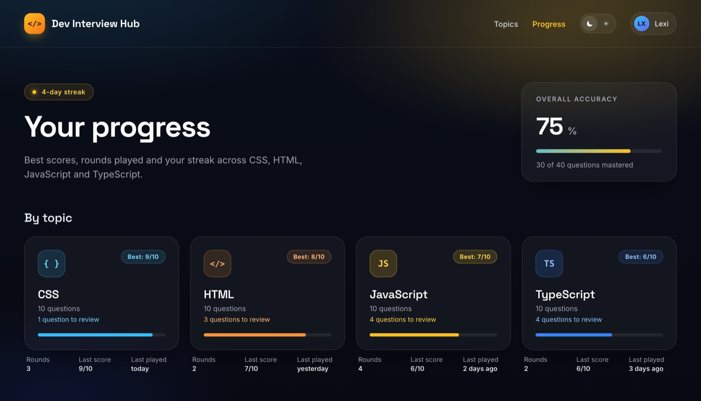

# Dev Interview Hub

A quiz app for Junior Frontend / Full-Stack interview prep: four topics (CSS,
HTML, JavaScript, TypeScript), ten single-choice questions each, scored results
and per-topic best scores. Glassmorphic dark and light themes at full parity.

**Live demo: [dev-interview-hub.vercel.app](https://dev-interview-hub.vercel.app/)**



## Features

- **Four topic rounds** — CSS, HTML, JavaScript and TypeScript, ten
  single-choice questions each, with code fragments in the prompts and answers
  rendered as inline code.
- **Scored results** — score ring, correct/missed tally, round time and a
  per-question breakdown, with retry and back-to-topics actions.
- **Review mistakes** — replay only the questions you missed, with the right
  answer and a one-line explanation after each pick.
- **Keyboard shortcuts** — `A`–`D` or `1`–`4` pick an answer, `Enter`
  continues.
- **Answer sounds** — a short tone on each pick, generated with the Web Audio
  API; the header toggle turns it off and the choice is remembered.
- **Progress that sticks** — best score, rounds played, last score and last
  played date per topic, plus a day streak and overall accuracy, kept in
  `localStorage` so no account is needed.
- **Guidance, not just numbers** — topics are sorted weakest-first, the weakest
  topic is highlighted, cards say how many questions are left to review, and on
  mobile a sticky button resumes the most recent round.
- **Dark and light at parity** — `"system" | "dark" | "light"`, applied before
  first paint so there is no flash; `"system"` keeps following the OS.
- **Phone-first** — one breakpoint (`sm` = 520px); base styles are the phone
  layout.

|                    Quiz round (light)                    |                     Progress (dark)                      |
| :------------------------------------------------------: | :------------------------------------------------------: |
|  |  |

## Stack

Next.js (App Router) · TypeScript · Tailwind CSS v4 · shadcn/ui (Radix) ·
Neon Postgres + Drizzle ORM · Vitest + React Testing Library · ESLint +
Prettier

## Pages

| Route                   | Shows                                                    |
| ----------------------- | -------------------------------------------------------- |
| `/`                     | Topic picker, streak and overall accuracy                |
| `/quiz/[topic]`         | Ten-question quiz for one topic                          |
| `/quiz/[topic]/results` | Score, tally and per-question breakdown for that attempt |
| `/progress`             | Best score, rounds and last played per topic             |

## Getting started

Questions are stored in a [Neon](https://neon.tech) Postgres database, so the
app needs a connection string before it can show a quiz.

```bash
npm install
cp .env.example .env.local   # then paste your Neon connection string into DATABASE_URL
npm run db:migrate           # create the tables
npm run db:seed              # load the 40 questions
npm run dev
```

## Scripts

| Command                | What it does                                              |
| ---------------------- | --------------------------------------------------------- |
| `npm run dev`          | Dev server on http://localhost:3000                       |
| `npm run build`        | Production build — needs `DATABASE_URL`                   |
| `npm start`            | Serve the production build                                |
| `npm run typecheck`    | `next typegen && tsc --noEmit`                            |
| `npm run lint`         | ESLint                                                    |
| `npm run lint:fix`     | ESLint, autofixing what it can                            |
| `npm run format`       | Prettier over JS/TS files                                 |
| `npm run format:check` | Prettier check — writes nothing                           |
| `npm test`             | Vitest (single run)                                       |
| `npm run test:watch`   | Vitest in watch mode                                      |
| `npm run db:generate`  | Turn schema changes into a SQL migration in `drizzle/`    |
| `npm run db:migrate`   | Apply pending migrations                                  |
| `npm run db:push`      | Push the schema straight to the database, no migration    |
| `npm run db:seed`      | Delete every question row, then reinsert the seed set     |
| `npm run db:studio`    | Drizzle Studio, a browser UI for the database             |

## Project structure

The app follows a [feature-driven
architecture](https://dev.to/rufatalv/feature-driven-architecture-with-nextjs-a-better-way-to-structure-your-application-1lph):
code is grouped by what it does, not by what it is. Each domain is one
self-contained module under `src/features/` that owns its components, hooks and
services.

```
src/
  app/                     Routes (page.tsx / layout.tsx), globals.css + its
                           test, and the app icon
  components/              Domain-agnostic UI shared across features
    ui/                    shadcn/ui primitives — kept flat for `shadcn add`
    inline-code-text/
    surface/
    topic-icon-tile/
  features/                One self-contained module per domain
    home/
      components/          home-view
    progress/
      components/          progress-view · topic-card
      hooks/               use-progress
      services/            progress (model + streak math) ·
                           progress-store (localStorage) ·
                           progress-summary (accuracy, status copy, ordering)
    quiz/
      components/          quiz-view · results-view · review-view ·
                           quiz-provider · quiz-header · answer-options ·
                           breakdown-table · score-ring · shortcut-hint
      hooks/               use-answer-shortcuts
      services/            quiz (round reducer) · results (scoring + copy)
    shell/
      components/          page-shell · site-header · nav-link · logo-tile ·
                           avatar-pill
    sound/
      components/          sound-toggle
      hooks/               use-sound
      services/            sound · sound-store (localStorage) ·
                           sound-player (Web Audio)
    theme/
      components/          theme-toggle · theme-sync · inline-script
      hooks/               use-theme
      services/            theme · theme-store
    tokens/
      components/          token-panel (the dev-only /tokens sheet)
  hooks/                   App-wide hooks — use-today
  lib/                     Feature-agnostic core — questions/ (seed content +
                           types) · db/ (schema, query, seed script) ·
                           inline-code · tones · design-tokens · profile
  test/                    Shared test helpers and repo-wide checks
  utils/                   cn.utils.ts · date.utils.ts
drizzle/                   Generated SQL migrations
```

### Conventions

- **A domain lives in exactly one place.** Everything named for `progress` — the
  view, the hook, the store, the summary logic — sits under
  `features/progress/`, never scattered between `lib/`, `hooks/` and
  `features/`.
- **One directory per module**, named after it, holding the module and its test:
  `lib/inline-code/{inline-code.ts, inline-code.test.ts}`. Tests live beside the
  code they cover. `components/ui/` is the one exception — it stays flat so the
  shadcn CLI keeps writing into it unchanged.
- **`components/` holds only domain-agnostic UI.** A file there never imports
  from another `components/` subdirectory (`components/ui/*` is the sole
  exception), and never from `features/` or `hooks/`.
- **Dependencies point one way:** `app/ → features/ → components/, lib/,
  utils/`. Features may depend on each other (`home` uses `progress`, `quiz`
  uses `sound`, `shell` uses `theme`); `lib/` depends on nothing above it.
- **`app/` holds routes only** — no `_components/` folders; a route composes
  pieces from `features/`.
- **Style is enforced, not argued.** Prettier owns JS/TS formatting —
  semicolons, indentation, line breaks. ESLint owns what a formatter cannot
  express: braces on every block body, a blank line around each block, and
  `===` over `==`. `npm run lint:fix` then `npm run format` fixes all of it.

## Data

- **Questions live in Postgres.** The schema is
  [`src/lib/db/schema.ts`](src/lib/db/schema.ts); the TypeScript files under
  `src/lib/questions/` are the seed source for `npm run db:seed` and the
  fixtures the tests run against, so tests never touch the database.
- **The query is cached.** `getQuestionsForTopic` uses `"use cache"` with the
  `questions` tag and the quiz routes are prerendered at build time. Nothing
  invalidates the tag yet, so reseeded questions appear after the next deploy.
- **Topics are static** — the four topic definitions stay in
  `src/lib/questions/topics.ts`.
- **Progress, theme and sound stay in the browser** (`localStorage` keys
  `progress`, `theme`, `sound`).

## Deployment

The app is deployed on [Vercel](https://vercel.com) at
<https://dev-interview-hub.vercel.app/>. Vercel detects Next.js and runs
`npm run build`; the project needs one environment variable, `DATABASE_URL`
(the Neon connection string), because the build reads the questions.

## Design tokens & theming

- Every color, radius, shadow and font size is a CSS custom property in
  [`src/app/globals.css`](src/app/globals.css). Theme-dependent values are
  defined once under `[data-theme="dark"]` and once under
  `[data-theme="light"]`; Tailwind utilities (`bg-glass`, `text-ink-muted`,
  `shadow-card`, `rounded-card`, `text-question`…) read them via
  `@theme inline`. Component code never contains a raw color — a test enforces
  it.
- Accent families (`css`, `html`, `js`, `ts`, `correct`, `incorrect`, `brand`,
  `streak`, `neutral`, `glass`) are `tone-*` utilities that point generic
  `--tone-*` slots at one palette, so pills, card hovers and progress fills take
  a `tone` prop instead of per-topic styles.
- The theme preference is `"system" | "dark" | "light"` in `localStorage`
  (`theme`). An inline script in the root layout sets `data-theme` on `<html>`
  before first paint; `"system"` keeps tracking OS changes live. The ☾/☀ toggle
  pins a theme; picking the lit segment again returns to `"system"`.
- One breakpoint: `sm` = 520px. Base styles are the phone layout.

Visit **`/tokens`** in development for the reference sheet: every primitive in
every state, rendered in both themes side by side. It returns 404 in production,
so it isn't available on the Vercel deployment.
